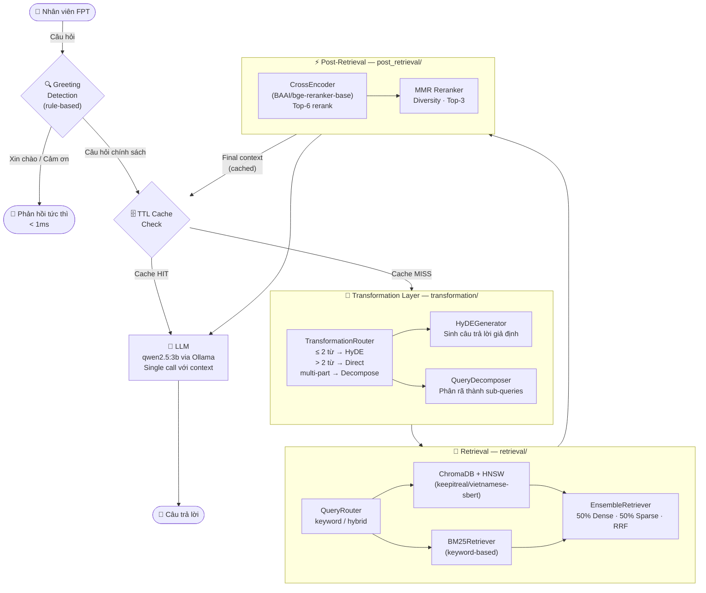
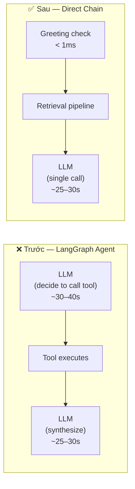
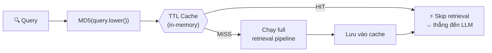
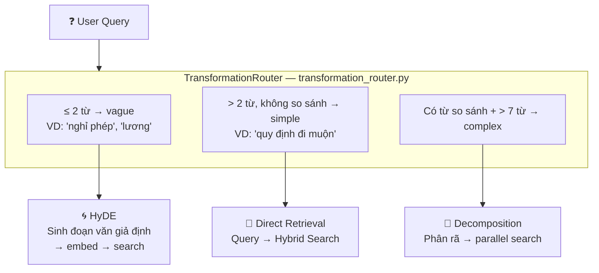
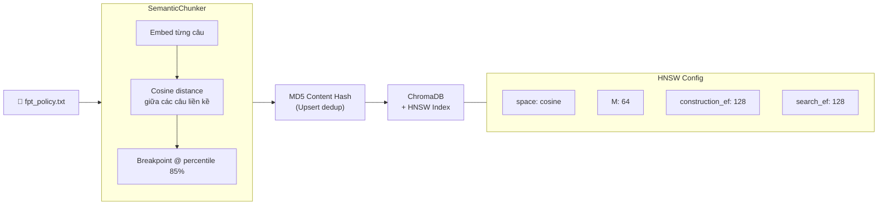

# 🤖 FPT HR Assistant — RAG Chatbot

> Hệ thống hỏi đáp chính sách nhân sự thông minh cho Tập đoàn FPT, xây dựng trên nền tảng **Retrieval-Augmented Generation (RAG)** với các kỹ thuật nâng cao:
> **Semantic Chunking + HNSW · Hybrid Search · Adaptive Query Transformation · Cross-Encoder Reranking · TTL Retrieval Cache**

---

## 📐 Kiến Trúc Backend



---

## 🚀 Quick Start

```bash
# Cài đặt dependencies
make setup

# Khởi chạy toàn bộ hệ thống (Backend + Frontend)
make start

# Hoặc chạy riêng từng phần
make backend     # FastAPI tại http://localhost:8000
make frontend    # React/Vite tại http://localhost:5173
```

---

## 📦 Cấu Trúc Dự Án

```
RAG-advanced/
├── Makefile                              # Entrypoint: setup · start · clean
├── resources/
│   └── fpt_policy.txt                   # Dữ liệu chính sách HR
├── frontend/                            # React + Vite
│   └── src/
│       └── App.jsx                      # Chat UI component
└── backend/
    ├── app/
    │   ├── main.py                      # FastAPI: CORS, router mount
    │   └── api/chat.py                  # POST /api/chat endpoint
    ├── core/
    │   ├── config.py                    # Pydantic Settings (env, model params, cache)
    │   └── device.py                    # GPU auto-detection (CUDA → MPS → CPU)
    ├── indexing/
    │   ├── vector_store.py              # ChromaDB + HNSW init & ingestion
    │   └── semantic_chuck.py            # SemanticChunker pipeline
    ├── transformation/                  # ⭐ Query Transformation Layer
    │   ├── transformation_router.py     # Adaptive Router (simple/vague/complex)
    │   ├── hyde.py                      # HyDE – Hypothetical Document Embeddings
    │   └── query_decomposition.py       # Multi-query Decomposition
    ├── retrieval/
    │   ├── query_router.py              # keyword / hybrid routing
    │   ├── hybrid_search.py             # EnsembleRetriever (Dense + Sparse)
    │   └── bm25_retriever.py            # BM25 with disk persistence
    ├── post_retrieval/
    │   ├── cross_encoder_reranker.py    # BAAI/bge-reranker-base
    │   ├── mmr.py                       # Maximum Marginal Relevance
    │   └── post_retrieval_pipeline.py   # CE + MMR pipeline
    └── rag/
        └── engine.py                    # Direct RAG Chain + TTL Cache
```

---

## ⭐ Advanced Features

### 1. ⚡ Direct RAG Chain (không Agent overhead)

> **File:** `rag/engine.py`

Thay vì dùng LangGraph Agent (phải gọi LLM để *quyết định* gọi tool), hệ thống sử dụng **Direct RAG Chain** — loại bỏ một LLM call không cần thiết.



**Tiết kiệm: ~30–40s mỗi request**

---

### 2. 🗄️ TTL Retrieval Cache

> **File:** `rag/engine.py → TTLCache`

Kết quả retrieval sau reranking được cache theo MD5 hash của query. Request lặp lại được phục vụ tức thì mà không cần gọi lại retrieval pipeline.



| Config | Giá trị mặc định | Ý nghĩa |
|--------|-----------------|---------|
| `CACHE_TTL_SECONDS` | `3600` | 1 giờ trước khi cache entry hết hạn |
| `CACHE_MAX_SIZE` | `256` | Tối đa 256 queries được cache |

- **Thread-safe**: dùng `threading.Lock()`
- **Eviction**: khi đầy, tự xóa entry cũ nhất
- **Key normalization**: `MD5(query.strip().lower())` — khớp cả khi user gõ khác case/space

**Tiết kiệm: ~60–70s cho mọi query lặp lại**

---

### 3. 🔄 Adaptive Query Transformation

> **Files:** `transformation/`

Hệ thống **tự động phân loại câu hỏi** (rule-based, không dùng LLM) và chọn pipeline phù hợp.



> **Lưu ý:** Router dùng **pure rule-based logic** — không gọi LLM, không tốn thời gian.

---

### 4. 🧩 Semantic Chunking + HNSW Index

> **Files:** `indexing/`



---

### 5. 🔀 Hybrid Search (Dense + Sparse)

> **File:** `retrieval/hybrid_search.py`

Kết hợp ChromaDB (semantic) và BM25 (keyword) qua `EnsembleRetriever` với Reciprocal Rank Fusion.

| | Dense (ChromaDB) | Sparse (BM25) |
|---|---|---|
| **Điểm mạnh** | Hiểu ngữ nghĩa, từ đồng nghĩa | Khớp từ khóa chính xác, viết tắt |
| **Điểm yếu** | Miss từ kỹ thuật hiếm | Không hiểu ngữ nghĩa |
| **Weight** | 50% | 50% |

---

### 6. 🎯 Cross-Encoder + MMR Reranking

> **Files:** `post_retrieval/`

Hai bước reranking sau khi retrieve:

1. **Cross-Encoder** (`BAAI/bge-reranker-base`): đánh giá relevance query↔chunk, chọn Top-6
2. **MMR** (Maximal Marginal Relevance): đảm bảo đa dạng, loại bỏ chunk trùng lặp, chọn Top-3

---

## ⚙️ Cấu Hình

Tất cả thông số tại `core/config.py`, override qua `.env` ở root:

### Model Settings

| Biến | Mặc định | Mô tả |
|------|---------|-------|
| `LLM_MODEL` | `qwen2.5:3b` | LLM cho answer generation |
| `EMBEDDING_MODEL` | `keepitreal/vietnamese-sbert` | Embedding cho ChromaDB + HyDE |
| `CROSS_ENCODER_MODEL` | `BAAI/bge-reranker-base` | Reranker model |
| `LLM_TEMPERATURE` | `0.0` | Deterministic output |

### Cache Settings

| Biến | Mặc định | Mô tả |
|------|---------|-------|
| `CACHE_TTL_SECONDS` | `3600` | Thời gian sống của cache entry |
| `CACHE_MAX_SIZE` | `256` | Số lượng query tối đa được cache |

### Retrieval Settings

| Biến | Mặc định | Mô tả |
|------|---------|-------|
| `RETRIEVER_K` | `3` | Top-K từ Dense retriever |
| `RETRIEVER_K_BM25` | `3` | Top-K từ BM25 |
| `SEARCH_ORDER` | `mmr_first` | Thứ tự reranking (`ce_first` / `mmr_first`) |

### HNSW Index Parameters

| Thông số | Giá trị | Tác động |
|----------|---------|---------|
| `hnsw:space` | `cosine` | Phù hợp với text embedding |
| `hnsw:M` | `64` | Tăng recall (4× default) |
| `hnsw:construction_ef` | `128` | Chất lượng đồ thị khi build |
| `hnsw:search_ef` | `128` | Recall khi search |

> **Lưu ý:** `HNSW_metadata` chỉ có hiệu lực khi tạo collection lần đầu. Muốn thay đổi: xóa `indexing/chroma_db/` và ingest lại.

---

## 📊 Performance Benchmark

| Scenario | Trước tối ưu | Sau tối ưu | Tiết kiệm |
|----------|-------------|-----------|-----------|
| Query > 2 từ (cold) | ~80s | **~30–40s** | -50% |
| Query ≤ 2 từ — HyDE (cold) | ~80s | **~50–60s** | -30% |
| Query lặp lại (cache hit) | ~80s | **~25–30s** | -65% |
| Greeting / chitchat | ~80s | **< 1ms** | -99.99% |

> Benchmark trên Intel i5-12450HX (12 cores), không GPU, `qwen2.5:3b` 100% CPU.

---

## 🔑 Yêu Cầu Hệ Thống

- **Python** ≥ 3.10
- **Ollama** đang chạy cục bộ:
  ```bash
  ollama pull qwen2.5:3b
  ollama pull qwen3-embedding   # hoặc embedding model khác
  ```
- **GPU** (tùy chọn): NVIDIA CUDA hoặc Apple MPS — tự động detect, không cần cấu hình
- **uv** package manager: `pip install uv`
- **Node.js** ≥ 18 (cho Frontend)

---

## 🛠️ Stack Công Nghệ

| Tầng | Công nghệ |
|------|-----------|
| **LLM** | qwen2.5:3b (via Ollama) |
| **Embedding** | keepitreal/vietnamese-sbert (HuggingFace) |
| **Reranker** | BAAI/bge-reranker-base (CrossEncoder) |
| **Vector DB** | ChromaDB + HNSW |
| **Sparse Retrieval** | BM25 (langchain-community, persisted) |
| **Chunking** | SemanticChunker (langchain-experimental) |
| **RAG Engine** | Direct Chain (LangChain Core) |
| **Cache** | In-memory TTL Cache (pure Python) |
| **Backend API** | FastAPI + Uvicorn |
| **Frontend** | React + Vite |
| **Settings** | Pydantic Settings v2 |
| **Device** | Auto-detect: CUDA → MPS → CPU |
